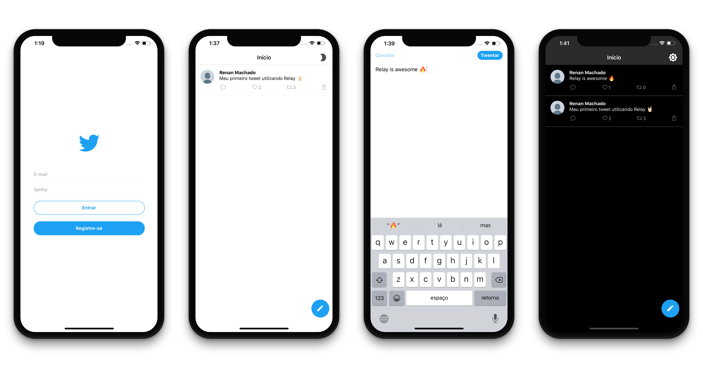

# Relay twitter app

A twitter clone basic features built with Reason, React Native, Relay Modern and GraphQL. 🔥

There are versions built in Typescript on `ts/hoc` and `ts/hooks` branches

# Main Features

- Login (and persistence) with JWT authentication
- Realtime updates with GraphQL Subscriptions
- Dark theme with local management store of Relay
- UI optimistic updates
- Relay hooks

# Project Structure

This is a React Native mobile app targeting Android and iOS.

The Javascript code is in the `src` folder and the
different native apps are in `android` and `ios`.

As well, this server repo is [here](https://github.com/renanmav/entria-fullstack) and it is [hosted on Heroku](https://relay-twitter-server.herokuapp.com/graphiql), so it may take a few minutes because Heroku's cold start.

# Setup

Once you cloned this repo, run:

- `yarn` or `npm i` to install dependencies.
- `yarn android` or `yarn ios` based on which target you're working on.
